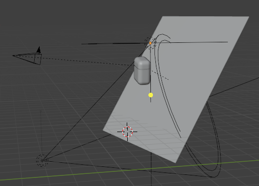
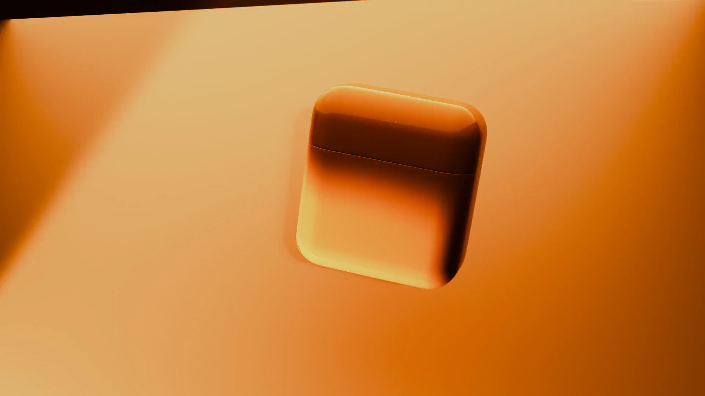

<h1 align="center">Slušalice u boji</h1>

## Pregled projekta

Projekt „Ples boja: Slušalice u pokretu“ osmišljen je s ciljem da se pokaže kako se i svakodnevni predmeti, koji nas okružuju i koje često uzimamo zdravo za gotovo, mogu prikazati na vizualno privlačan i umjetnički način. Odabrani predmet bile su slušalice, koje su dio gotovo svakodnevne uporabe, ali se rijetko promatraju iz perspektive vizualnog izraza. Ideja je bila spojiti njihovu funkcionalnost – izvlačenje i vraćanje u kutiju – s estetikom koja se ogleda u rotaciji, promjenama boja i sinkronizaciji s pozadinom. Time se jednostavan objekt pretvara u glavni nositelj narativa kratke animacije koja, osim tehničke strane, ima i umjetničku dimenziju. Projekt tako istražuje mogućnost da digitalna animacija naglasi ono što je oku svakodnevno neprimjetno, dajući običnim predmetima novu estetsku vrijednost.

## Ciljevi

Glavni cilj ovog projekta bio je izraditi kratku animaciju koja će prikazati slušalice u novom svjetlu, naglašavajući njihovu dinamiku kroz pokret i promjene boja. Ujedno je cilj bio savladati i unaprijediti vlastite tehničke vještine u području 3D modeliranja i animacije, posebice u radu s kamerom i rasvjetom. Dodatni cilj odnosio se na postizanje vizualne usklađenosti između objekta i pozadine, pri čemu je naglasak bio na sinkronizaciji boja. Na taj način animacija ne ostaje samo tehnički eksperiment, nego dobiva i umjetničku dimenziju koja doprinosi njenoj estetskoj vrijednosti. Projekt je ujedno poslužio kao prilika za istraživanje i praktičnu primjenu kreativnih mogućnosti softvera Blender, što predstavlja važan korak u daljnjem usavršavanju u području računalne grafike.

## Metodologija

Izrada projekta započela je modeliranjem osnovnih objekata, odnosno kutije i slušalica, pri čemu je posebna pažnja posvećena jednostavnosti oblika kako bi naglasak bio stavljen na samu animaciju. Nakon dovršetka modeliranja uslijedila je primjena materijala i oblikovanje pozadine koja je zamišljena tako da prati promjene boja slušalica. Time je stvoren vizualni kontrast koji doprinosi jedinstvenom dojmu cjeline. U ovoj fazi postavljena su i svjetla te kamera, pri čemu je kamera namjerno ostavljena u pokretu kako bi se postigao dinamičniji doživljaj i gledatelju pružio osjećaj praćenja radnje izbliza.

  

Sama animacija oblikovana je tako da traje pet sekundi, a u tom vremenu slušalice prolaze kroz nekoliko različitih transformacija. One se rotiraju u svim smjerovima, izlaze iz kutije te se na kraju vraćaju u nju, čime se postiže jasna i zaokružena struktura radnje. Paralelno s pokretima odvija se i promjena boja, koja je usklađena s pozadinom. Na taj način naglašava se umjetnički aspekt rada, jer se funkcionalni predmet pretvara u estetski doživljaj boje i ritma. U provedbi projekta korišten je Blender, softver koji nudi širok raspon mogućnosti za modeliranje, animaciju i renderiranje, a odabran je zbog svoje dostupnosti i fleksibilnosti.

## Rezultati

Konačni rezultat projekta jest kratka animacija koja uspješno spaja funkcionalne i estetske elemente u jedinstvenu cjelinu. Slušalice, koje se u početku doimaju kao običan predmet, kroz kretanje, promjene boja i sinkronizaciju s pozadinom poprimaju potpuno novu vizualnu dimenziju. Posebno zanimljiv element animacije predstavlja harmonija između objekta i pozadine, koja se postiže promjenom boja u istom ritmu. Time se stvara dojam skladnog umjetničkog izraza, dok kretanje kamere naglašava dinamiku i pridonosi dojmu živosti scene. Završetak animacije, u kojem se slušalice vraćaju u kutiju, daje radnji zaokružen oblik i ostavlja gledatelju dojam cjelovitosti.

Tijekom izrade projekta suočio sam se s određenim izazovima, posebno u usklađivanju pokreta i promjena boja. Bilo je potrebno pažljivo podešavati ključne sličice (keyframes) kako bi svi elementi bili usklađeni i kako bi prijelazi izgledali prirodno. Dodatni izazov odnosio se na dinamiku same scene, koja je u početku djelovala statično. Ovaj je problem uspješno riješen uvođenjem kamere u pokretu, što je animaciji dalo dodatnu slojevitost i vizualnu zanimljivost.

  

## Budući rad

Iako je projekt postigao svoj osnovni cilj, postoje brojne mogućnosti za daljnji razvoj i unapređenje. Kada bi bilo više vremena i resursa, animacija bi se mogla produžiti i obogatiti dodatnim fazama radnje, čime bi se stvorila složenija naracija. Modeli bi se mogli dodatno razraditi i učiniti realističnijima, čime bi se povećala vjerodostojnost i vizualna kvaliteta cijelog rada. Također, bilo bi zanimljivo uvesti i zvučni element sinkroniziran s promjenama boja i pokretima slušalica, što bi doprinijelo višesenzornom doživljaju. Naprednija primjena rasvjete i okruženja, uključujući HDRI mapiranje i realistične refleksije, dodatno bi unaprijedila konačan vizualni dojam i učinila animaciju još uvjerljivijom.

## Kako koristiti

Projekt je izrađen u softveru **Blender**.  
Za pregled i uređivanje potrebno je:
1. Preuzeti datoteku `earphones_comm.blend` iz repozitorija `3d_Blender`.
2. Otvoriti datoteku u Blenderu (verzija 3.x ili novija).
3. Pokrenuti animaciju pritiskom na tipku **Play** u timelineu.
4. Za renderiranje animacije potrebno je otvoriti karticu *Output Properties* i odabrati željeni format izvoza (npr. MP4).

Link na prezentaciju: https://drive.google.com/file/d/1fs-gH_TacD19QIiCOoRS-9MwKiZjBuN5/view?usp=drive_link
